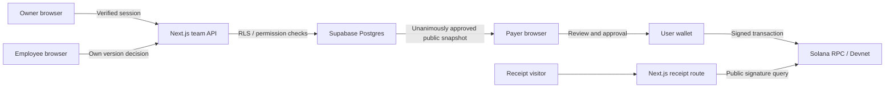

# Allot Threat Model

## Overview

Source snapshot reviewed on 2026-10-07 in `/Users/nuzzo/Documents/FOUNDERbrain`. The Git branch has no commits, so this model describes a mutable local checkout, not an immutable release. This is architecture analysis, not a completed vulnerability assessment.

Allot implements Supabase accounts, private teams, code/link invitations, versioned recipient approvals, public approved payment snapshots, and Solana Devnet payments. Legacy encoded links remain readable with an explicit unverified-provenance warning. The threat scenarios below remain hypotheses, not validated vulnerabilities.

| Component | Relevant source | Responsibility |
| --- | --- | --- |
| Creator form | `app/components/create-payment-form.tsx` | Validates team proposals and submits them through the authenticated API. |
| Link decoder | `app/lib/payment-link.ts:98` | Parses and validates public request data. |
| Public payer route | `app/pagar/page.tsx` | Loads an immutable approved snapshot by random share ID, or explicitly labels a legacy encoded link. |
| Payment action | `app/components/payment-review.tsx:105` | Obtains a wallet signer, checks balances, and requests submission. |
| Transaction builder | `app/lib/split-transaction.ts:123` | Combines transfers and a public title memo in one transaction. |
| Receipt reader | `app/lib/receipt.ts:169` | Queries an externally supplied transaction signature and derives public results. |
| Network configuration | `app/lib/config.ts:5` | Resolves RPC configuration with a public Devnet fallback. |
| Accounts and teams | `app/api/auth/route.ts`, `app/api/teams/route.ts`, `proxy.ts`, `db/teams.sql`, `db/teams-hardening.sql`, `db/teams-validation.sql` | Verified cookie sessions, origin checks, RLS isolation, owner/recipient permissions, serialized approval and publication. |

| Deployment or workflow | Resource or capability | Configuration and precedence | Safe effective value or location | Readers, writers, or recipients | Enforcing control | Evidence or unknowns |
| --- | --- | --- | --- | --- | --- | --- |
| Browser payment and server receipt lookup | RPC access | `NEXT_PUBLIC_SOLANA_RPC_URL`, then public fallback | Browser-visible URL; fallback targets Devnet | Browser/server send queries to configured RPC | Fixed Devnet chain and mint are configured; custom endpoint trust is an operator responsibility | `app/lib/config.ts`, `app/lib/solana-client.ts`; live endpoint settings not verified |
| Wallet signing | Transaction authority | Connected Wallet Standard account on `solana:devnet` | Wallet-held signing capability | User wallet signs; RPC receives transaction | Wallet approval | `app/components/payment-review.tsx`; physical wallet behavior not validated here |
| Private workspace | Account session and team access | Supabase project `gjixddthtgibbkceraya`; Vercel environment variables | Publishable key; HttpOnly cookies | Browser, Next.js server, Auth, Postgres | Verified server identity, persistent membership, RLS, restricted RPC grants | `Auth.md`; role-level and local HTTP tests passed |

## Threat Model, Trust Boundaries, and Assumptions

Protected assets are payment integrity, correct confirmation state, wallet signing authority, deployment credentials, and account/session/team data.

An unauthenticated attacker can craft or alter a payment URL, submit arbitrary route parameters, view public receipts, and induce traffic to public routes. A malicious payer controls their own browser and wallet but not another wallet's signing key. In the team subsystem, an ordinary authenticated member must be treated as an attacker with respect to other teams and owner-only actions.

Do not assume attackers already control the hosting environment, the configured RPC, a team owner, or a victim wallet. Compromise of those resources is a separate prerequisite with different impact.

Existing boundaries and controls:

- Public input enters a strict Zod schema with address, amount, recipient-count, uniqueness, and percentage validation in `app/lib/payment-link.ts`.
- Token arithmetic uses `bigint` and exact units in `app/lib/money.ts`.
- Recipient validation and atomic transfer construction occur in `app/lib/split-transaction.ts`.
- Wallet signing is separate from the web page's rendering and state.
- Receipt signatures are parsed before an RPC lookup in `app/lib/receipt.ts`.
- Payment-error normalization preserves uncertainty and can prevent a retry in `app/lib/payment-errors.ts`.

These source controls do not prove safety under every dependency, wallet, RPC, or deployment configuration. Canonical URL encoding is not a signature. A public receipt is not proof of a person's civil identity or team membership.

Team boundaries enforce verified sessions, current membership, owner/recipient authorization, RLS isolation, origin checks, safe local returns, and public/private separation. Invitations are 128-bit reusable bearer codes lasting seven days; possessing a code allows a confirmed account to join. Sharing a code with the wrong person is a concrete access risk.

Founder-confirmed workflow: the owner distributes percentages; included employees may accept, reject, or counter their own percentage; publication requires unanimous acceptance. Any revision needs a new approval round. SQL checks verified this publication boundary and rejection of stale decisions.

Unknowns: real email delivery, session expiry/revocation behavior, abuse limits under load, backups, retention, and incident contact. Custom SMTP is not configured, so email registration is limited to the Supabase organization's pre-authorized addresses. No risks are accepted merely because they are listed here.

## Attack Surface, Mitigations, and Attacker Stories

The following are scenarios for implementation and testing, not confirmed vulnerabilities.

| Priority | Scenario and capability gain | Prerequisites | Impact | Existing controls | Mitigation | Evidence |
| --- | --- | --- | --- | --- | --- | --- |
| High | A member changes a team/record ID to read or mutate another team's payments | Authenticated API/database access | Cross-team disclosure or unauthorized payment changes | Server identity plus RLS and team-membership checks | Server authorization plus RLS; test direct API calls with users from two teams | `Auth.md` |
| High | A member submits an owner role or calls invite/removal operations directly | Authenticated membership operations | Team takeover or unauthorized access grants | Owner guard in private mutation function | Ownership from controlled database records; owner-only mutations; no user-metadata authorization | `Auth.md` |
| High | An owner publishes despite pending/rejected/countered shares or forges an employee's acceptance | Owner account or authenticated recipient | Unapproved payment terms become payable | Recipient identity derived from auth.uid(); unanimous accepted-version check | Decisions bound to session recipient and immutable version; atomic publication checks every required acceptance | `Auth.md`, `security.md` |
| High | A revision or member removal races publication, reusing acceptance of old terms | Concurrent authenticated operations | Payable request differs from the accepted split | Team row lock serializes all mutations; snapshots are immutable | Immutable snapshots, stale-version rejection, active-membership recheck, consistent transactional locking | `Auth.md` |
| High | A stolen or carelessly shared valid invitation grants membership | Attacker obtains a valid bearer code | Unauthorized team access | Hashed 128-bit codes; confirmed account, expiry, and rotation | Share codes only with intended members; rotate/revoke; test expiry and removal. A shared code is deliberately reusable, not email-bound. | `Auth.md`, `DataSecurity.md` |
| High | Session theft or a forged session enables victim-account operations | Account credentials/session are compromised | Account and team compromise | HttpOnly/SameSite cookies, verified server identity, private cache headers | Maintained provider integration, verified server sessions, safe cookies, no shared cache, redacted logs | `Auth.md` |
| High | An attacker edits a payment link so the payer signs different recipients | Attacker supplies a link and payer approves its contents | Payment to unintended recipients | Strict parsing, full addresses, user review, wallet approval, Devnet-only scope | Preserve review; use canonical server records for new team requests; never infer verified creator identity from encoded data | `app/lib/payment-link.ts`, `app/components/payment-review.tsx` |
| Medium | An uncertain submission is retried and creates a second payment | Wallet/RPC confirmation uncertainty followed by retry | Duplicate transfer | Known signature preservation and `canRetry: false` for uncertain outcomes | Retain signature and require receipt/wallet-history review before another attempt | `app/lib/payment-errors.ts`, `app/lib/split-transaction.ts` |
| Medium | Public links or memo titles disclose confidential data | Users enter sensitive titles/names or logs capture URLs | Privacy loss outside team access controls | Links and blockchain records are intentionally public | Explain disclosure, minimize public projections, redact URL queries; never promise blockchain erasure | `app/components/create-payment-form.tsx`, `app/lib/split-transaction.ts:123` |
| Medium | Cross-site writes or a malicious return URL abuse a victim's session | Victim has a session or follows a crafted return URL | Unauthorized mutation or phishing/credential exposure | Origin validation and strict local return allowlist | CSRF/origin checks; allow only local return paths; test direct forged requests | `Auth.md` |
| Medium | Crafted or repeated public receipt requests exhaust RPC quota/server capacity | Public deployment reachable at volume | Availability degradation | Signature parsing and bounded retries; deployment-level limits unverified | Bound inputs and RPC time; configure distributed/edge rate limits and provider quotas | `app/lib/receipt.ts:169` |
| High | A privileged provider key is bundled into client code | Future configuration puts a secret in a public variable or import | Database/auth administration compromise | Environment ignore rules; no auth secret configured in app source | Publishable browser key only; separate server secrets; review bundles/logs and least privilege | `.gitignore`, `app/lib/config.ts:5` |

## Severity Calibration

- **Critical:** broad account or database takeover through a reachable unauthenticated path. This needs evidence of the reachable privilege and affected data; a theoretical provider compromise is insufficient.
- **High:** cross-team private reads/writes, owner escalation, account takeover, or a payment-integrity failure that bypasses meaningful payer approval. Devnet limits direct financial loss but does not excuse compromise of real account data.
- **Medium:** a reachable privacy or availability failure with limited scope, invitation misuse under constrained prerequisites, or a duplicate-payment path requiring uncertain confirmation and user retry.
- **Low:** limited disclosure or weak hardening with a narrow demonstrated effect. Missing headers alone do not establish an exploitable vulnerability.

Authorized access to one's own team and intentional public blockchain visibility are not cross-tenant breaches. A changed unsigned payment URL is not proof that a server record was altered. Escalate severity only when an attacker gains an authority or access they did not already possess.

Confidence and impact are separate: SQL checks ran against the live project using temporary identities and authenticated/anonymous roles, with rollback. Local HTTP checks cover a temporary confirmed account and session cookies. Real email confirmation, password recovery, simultaneous-request races, and wallet payment remain unverified.
